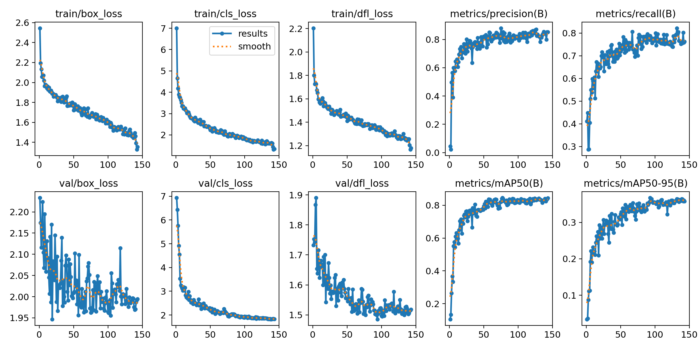
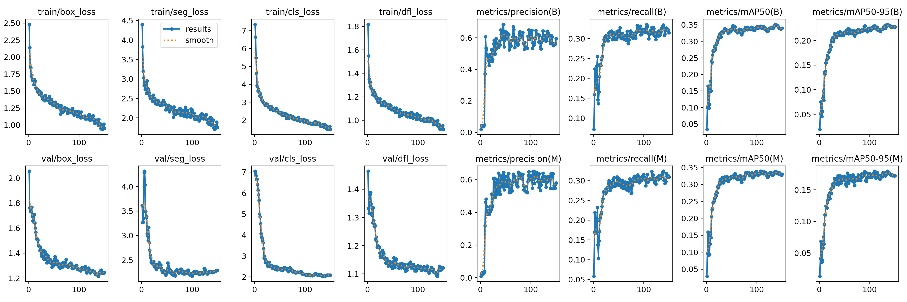

# YOLO11n vs YOLO11n-seg Evaluation Report

## **Dataset Overview**

- **Domain:** Detection and segmentation of *weeds* and *roses* in real agricultural field conditions  
- **Objective:** Compare bounding-box detection and instance segmentation performance on similar data  
- **Classes:**  
  - `0 – weed`  
  - `1 – rose`

---

## **1️. Dataset Splits**

| Model           | Task Type                         | Train Images | Validation Images | Total |
|-----------------|-----------------------------------|--------------|-------------------|-------|
| **YOLO11n**     | Object Detection (Bounding Boxes) | 180          | 26                | 206   |
| **YOLO11n-seg** | Instance Segmentation (Masks)     | 70           | 21                | 91    |

Both datasets come from the same domain but differ slightly in annotation format and count.  
The segmentation version uses polygon-based mask labels, converted into YOLO segmentation format.

> **Note:**  
> The segmentation dataset is **much smaller**, which naturally reduces mAP performance.  

---

## **2️. Training Configuration**

| Parameter          | YOLO11n                                                                                                                                                          | YOLO11n-seg      |
|--------------------|------------------------------------------------------------------------------------------------------------------------------------------------------------------|------------------|
| Base Model         | `yolo11n.pt`                                                                                                                                                     | `yolo11n-seg.pt` |
| Epochs             | 143 (Early stop due to patience)                                                                                                                                 | 150              |
| Image Size         | 1024×1024                                                                                                                                                        | 1024×1024        |
| Batch Size         | 9                                                                                                                                                                | 9                |
| Device             | GPU (CUDA 0)                                                                                                                                                     | GPU (CUDA 0)     |
| Augmentations      | MotionBlur, MedianBlur, RandomBrightnessContrast, CLAHE, ToGray, ImageCompression, GaussNoise + YOLO built-ins (HSV, rotation, scaling, flipping, mosaic, mixup) | Same             |
| Seed               | 42                                                                                                                                                               | 42               |
| Patience           | 50                                                                                                                                                               | 50               |
| Optimizer Settings | `cls=1.0`, `weight_decay=0.001`, `lrf=0.0005`                                                                                                                    | Same             |

Both trainings shared identical hyperparameters to ensure fair comparison.

---

## **3️. Quantitative Results**

### **Training Metrics Evolution**
### Yolo11n-bb

### Yolo11n-seg

### **Observations**

- **Loss Convergence:**  
  All key loss components (`box_loss`, `cls_loss`, `dfl_loss`, and `seg_loss`) show smooth decline, confirming stable training.  

- **Precision & Recall:**  
  - YOLO11n (detection): Precision stabilized around **0.78–0.87**, recall around **0.74–0.82**  
  - YOLO11n-seg (segmentation): **Precision** is lower (0.55–0.64) and recall is significantly lower (0.29–0.32).  

- **Mean Average Precision (mAP):**
 - YOLO11n (Detection):  
    - **mAP50 ≈ 0.82–0.84**  
    - **mAP50–95 ≈ 0.35-0.36**   
  
  - YOLO11n-seg (Segmentation):  
    - **mAP50 ≈ 0.33–0.34**  
    - **mAP50–95 ≈ 0.17–0.18**  

**Conclusion:**  
Segmentation has lower mAP due to task difficulty and smaller dataset, but provides **superior object boundary definition**.
---

## **4️. Qualitative Evaluation on Unseen Images**

Both models were tested on unseen field images not included in training or validation.

| YOLO11n-bb Predictions                    | YOLO11n-seg Predictions                       |
|-------------------------------------------|-----------------------------------------------|
|  |  |

### **Analysis**

- The segmentation model accurately outlines the plant contours and clearly separates *weeds* from *roses*.  
- Very thin rose branches are still partially missed.  
- Weeds are segmented with distinct, non-overlapping masks.  

---

## **5. Comparative Summary**

| Aspect                  | YOLO11n (Detection) | YOLO11n-seg (Segmentation) | Verdict                              |
|-------------------------|---------------------|----------------------------|--------------------------------------|
| Localization Type       | Bounding boxes      | Pixel-level polygons       | 🔵 Segmentation more detailed        |
| Small Weed Detection    | Good(High Recall)   | Poor(Low Recall)           | 🟢 Detection (Finds more)            |
| Background Noise        | Low(High Precision) | High(Lower Precision)      | 🟢 Detection (Fewer false positives) |
| Precision / Recall      | 0.84 / 0.77         | 0.59 / 0.31 (more stable)  | 🟢 Detection significantly better    |
| mAP50–95                | **≈ 0.36**          | **≈ 0.17**                 | 🟢 Detection higher                  |
| Visual Interpretability | Moderate            | High                       | 🔵 Segmentation clearly better       |

---

## **6️. Conclusions**

- YOLO11n (Detection) is the significantly stronger model in this comparison, achieving much higher recall (0.77 vs 0.31) and mAP.
- YOLO11n-seg struggles with consistency, missing approximately 70% of the weeds (low recall), likely due to the smaller training dataset (70 images).
- While segmentation theoretically offers better separation of overlapping objects, its current low recall makes it less reliable than the bounding box detector for simply counting or locating weeds.
- Dataset size is the critical bottleneck for the segmentation model; it likely needs a training set comparable size to the detection model (180+ images) to be competitive.

---

## **Summary**

> The YOLO11n detection model is currently the superior choice for this application, offering robust performance and high detection rates (Recall ≈ 0.77). While YOLO11n-seg provides valuable mask data for biomass estimation and precise targeting, its high miss rate (Recall ≈ 0.31) makes it unsuitable for deployment until the dataset is expanded to improve its reliability.

