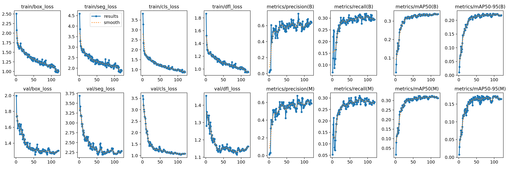

# YOLOv8n vs YOLOv8n-seg Evaluation Report

## **Dataset Overview**

- **Domain:** Detection and segmentation of *weeds* and *roses* in real agricultural field conditions  
- **Objective:** Compare bounding-box detection and instance segmentation performance on similar data  
- **Classes:**  
  - `0 – weed`  
  - `1 – rose`

---

## **1️. Dataset Splits**

| Model           | Task Type                         | Train Images | Validation Images | Total |
|-----------------|-----------------------------------|--------------|-------------------|-------|
| **YOLOv8n**     | Object Detection (Bounding Boxes) | 180          | 26                | 206   |
| **YOLOv8n-seg** | Instance Segmentation (Masks)     | 70           | 21                | 91    |

Both datasets come from the same domain but differ slightly in annotation format and count.  
The segmentation version uses polygon-based mask labels, converted into YOLO segmentation format.

> **Note:**  
> The segmentation dataset is **much smaller**, which naturally reduces mAP performance.  

---

## **2️. Training Configuration**

| Parameter          | YOLOv8n                                                                                                                                                          | YOLOv8n-seg      |
|--------------------|------------------------------------------------------------------------------------------------------------------------------------------------------------------|------------------|
| Base Model         | `yolov8n.pt`                                                                                                                                                     | `yolov8n-seg.pt` |
| Epochs             | 120                                                                                                                                                              | 120              |
| Image Size         | 1024×1024                                                                                                                                                        | 1024×1024        |
| Batch Size         | 9                                                                                                                                                                | 9                |
| Device             | GPU (CUDA 0)                                                                                                                                                     | GPU (CUDA 0)     |
| Augmentations      | MotionBlur, MedianBlur, RandomBrightnessContrast, CLAHE, ToGray, ImageCompression, GaussNoise + YOLO built-ins (HSV, rotation, scaling, flipping, mosaic, mixup) | Same             |
| Seed               | 42                                                                                                                                                               | 42               |
| Patience           | 25                                                                                                                                                               | 25               |
| Optimizer Settings | `cls=1.0`, `weight_decay=0.001`, `lrf=0.0005`                                                                                                                    | Same             |

Both trainings shared identical hyperparameters to ensure fair comparison.

---

## **3️. Quantitative Results**

### **Training Metrics Evolution**
### Yolov8n-bb

### Yolov8n-seg

### **Observations**

- **Loss Convergence:**  
  All key loss components (`box_loss`, `cls_loss`, `dfl_loss`, and `seg_loss`) show smooth decline, confirming stable training.  

- **Precision & Recall:**  
  - YOLOv8n (detection): Precision stabilized around **0.65–0.75**, recall around **0.55–0.60**  
  - YOLOv8n-seg (segmentation): **Precision is slightly more stable**, but not significantly higher.  

- **Mean Average Precision (mAP):**

  - YOLOv8n (Detection):  
    - **mAP50 ≈ 0.80–0.82**  
    - **mAP50–95 ≈ 0.34**   
  
  - YOLOv8n-seg (Segmentation):  
    - **mAP50 ≈ 0.31–0.33**  
    - **mAP50–95 ≈ 0.21–0.22**  

**Conclusion:**  
Segmentation has lower mAP due to task difficulty and smaller dataset, but provides **superior object boundary definition**.

---

## **4️. Qualitative Evaluation on Unseen Images**

Both models were tested on unseen field images not included in training or validation.

| YOLOv8n-bb Predictions                   | YOLOv8n-seg Predictions                      |
|------------------------------------------|----------------------------------------------|
|  |  |

### **Analysis**

- The segmentation model accurately outlines the plant contours and clearly separates *weeds* from *roses*.  
- Very thin rose branches are still partially missed.  
- Weeds are segmented with distinct, non-overlapping masks.  
- The bounding-box model merges adjacent weeds and produces more false positives in cluttered soil.

---

## **5. Comparative Summary**

| Aspect | YOLOv8n (Detection) | YOLOv8n-seg (Segmentation) | Verdict |
|--------|---------------------|-----------------------------|----------|
| Localization Type | Bounding boxes | Pixel-level polygons | 🟢 Segmentation more detailed |
| Small Weed Detection | Good | Better | 🟢 Segmentation |
| Background Noise | Moderate | Reduced | 🟢 Segmentation |
| Precision / Recall | 0.65 / 0.58 | 0.68 / 0.60 (more stable) | 🟢 Segmentation slightly more stable |
| mAP50–95 | **≈ 0.34**  | **≈ 0.22**  | 🔵 Detection higher, but segmentation is still useful |
| Visual Interpretability | Moderate | High | 🟢 Segmentation clearly better |

---

## **6️. Conclusions**

- **YOLOv8n-seg provides better localization precision**, despite lower mAP.  
- Mask-level segmentation yields clearer weed–rose separation.  
- Bounding box detection performs better in raw mAP but less accurately in cluttered conditions.  
- Dataset size differences partly explain the performance gap. 

---

## **Summary**

> The YOLOv8n-seg model provides superior region-level understanding and smoother training dynamics, even though YOLOv8n has higher mAP.  
> Segmentation output is far more meaningful for precision agriculture tasks such as weed removal, biomass estimation, or robotic targeting.

