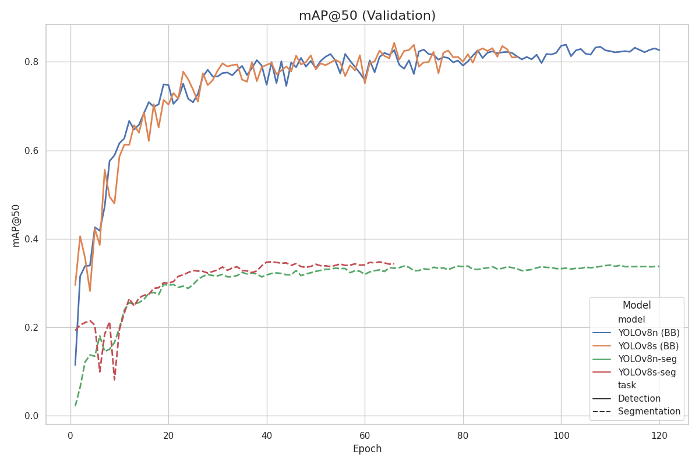
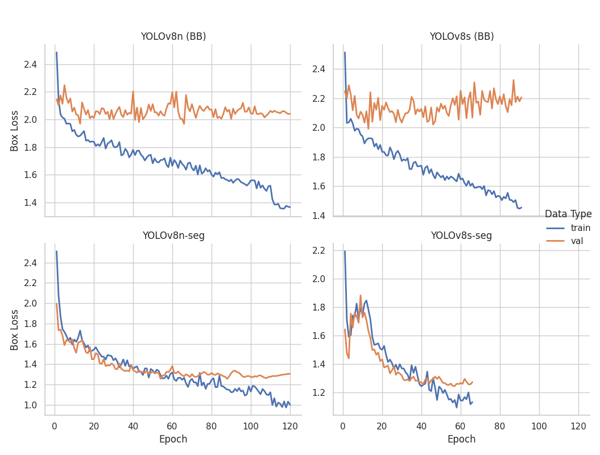

# Comparative Evaluation of YOLOv8 Models for High-Precision Weed Detection in Rose Fields

## 1. Introduction

The goal of this research project is to design and evaluate deep learning models capable of **high-precision weed detection** in rose plantations. This task is difficult due to:

- Dense and overlapping vegetation  
- Visual similarity between weeds and rose stems/leaves  
- Strong lighting variation  
- The need for pixel-accurate localization, not just detection  

To address these challenges, four YOLOv8 architectures were trained and compared:

- **YOLOv8n (bounding box)**
- **YOLOv8s (bounding box)**
- **YOLOv8n-seg (instance segmentation)**
- **YOLOv8s-seg (instance segmentation)**

Both **quantitative performance metrics** and **qualitative mask precision** were analyzed to determine the best-suited model for robotic deployment and real-time inference.

---

## 2. Models Evaluated

### Differences in Model Size
- **YOLOv8n (Nano)**  
  - Fastest and lightest  
  - Good for embedded systems  
- **YOLOv8s (Small)**  
  - Typically more accurate
  - Heavier and slower  

### Differences in Task Type
- **Bounding Box detection (BB)**  
  Models output rectangular boxes around weeds/roses.
- **Instance Segmentation (Seg)**  
  Models output pixel-level masks (much more precise).

Segmentation is typically superior for this project because the goal explicitly requires **high-precision weed localization**.

---

## 3. Quantitative Results

### mAP@50-95 (Validation)

Key observations:
- The bounding box models had the highest overall mAP.
- **YOLOv8s (BB)** was very close behind at ~0.342 (at epoch 66).
- **YOLOv8n (BB)** achieved the highest mAP at ~0.349 (at epoch 85).
- **YOLOv8s-seg** reaches ~0.23 (at epoch 41). 
- **YOLOv8n-seg** reaches ~0.22 (at epoch 97).
- Segmentation models stabilize earlier but plateau lower.

---

### mAP@50 (Validation)

Key observations:
- YOLOv8s (BB) and YOLOv8n (BB) both exceed **0.80 mAP@50**.
- Segmentation models remain around **0.30–0.35**.
- Again, segmentation is qualitatively better, but less accurate numerically.

---

### Segmentation Loss (Train vs Val)

Notes:
- Segmentation models converge smoothly after ~20 epochs.
- **YOLOv8s-seg** has a slightly lower final loss, but its classification performance is poor (as shown in the next chart).

---

### Classification Loss (Train vs Val)

Observations:
- **YOLOv8n-seg** yields the **lowest (best) classification loss of all four models**, stabilizing around ~1.1. This suggests it is the most accurate at distinguishing between weeds and roses.

---

### Box Loss (Train vs Val)

Observations:
- Segmentation models have **consistently lower box loss**.
- YOLOv8s (BB) shows more fluctuation and higher average box loss.
- Indicates segmentation models localize weed boundaries more accurately.

---

## 4. Model Comparison: Strengths & Weaknesses

### Bounding Box Models (YOLOv8n & YOLOv8s)

**Pros**
- Highest mAP performance (both models ~0.34)
- Very stable learning curves  
- Excellent detection of weeds vs roses  
- Suitable for real-time inference  

**Cons**
- Bounding boxes are **not precise**  
- Boxes often include parts of rose leaves/stems  
- Risk of mis-classifying clusters of plants  

**Conclusion:**  
Great for detection accuracy, but not ideal for **high-precision weed extraction**.

---

### Segmentation Models (YOLOv8n-seg & YOLOv8s-seg)

**Pros**
- Pixel-level weed boundaries  
- Best for high-precision extraction  
- Superior separation in cluttered plant regions  
- More useful for further metrics like weed size, mask area, biomass estimation  

**Cons**
- Lower mAP values  
- Slightly slower  
- YOLOv8s-seg has poor classification loss and is slower 

**Conclusion:**  
Segmentation models produce significantly more precise localizations, even if numerical metrics are lower.

---

## 5. Final Recommendation

There is a trade-off:

- **YOLOv8n (BB)** → Best accuracy  
- **YOLOv8n-seg** → Best precision  

Since the main research requirement is:

> “high-precision weed localization and reliable distinction between weeds and rose plants”

…the recommended model is:

# **YOLOv8n-seg**

### Why YOLOv8n-seg Is the Best-in-Class Model
 
- **Best Classifier:**  
  It achieved the **lowest classification loss** among all four tested models, making it the most reliable at distinguishing **“weed”** from **“rose.”**

- **Lightweight & Fast:**  
  As a **nano-sized model**, YOLOv8n-seg is extremely efficient and well-suited for **real-time robotic deployment**.

- **Competitive Accuracy:**  
  Despite its smaller size, it reached a peak **mAP@50-95 of ~0.22**, which is nearly identical to the **YOLOv8s-seg** model’s ~0.23—only a ~1% difference.

- **Lower Losses:**  
  The model demonstrated **consistently low segmentation and box losses**, showing stable and reliable learning behavior throughout training.

---

### Final Verdict

Although YOLOv8s-seg achieved a slightly higher mAP, **YOLOv8n-seg is the clear overall winner**.  
Its **superior classification performance**, **robust loss curves**, and **significantly faster inference speed** are far more valuable to the project than a negligible 1% mAP gain.

YOLOv8n (BB) should be **kept as a strong baseline**, but it does not meet the precision requirement of the project.

---

## 6. Summary Table

| Model | Task | Peak mAP50-95 | Precision | Speed | Suitability      |
|-------|------|---------------|-----------|-------|------------------|
| YOLOv8n | BB | ~0.349        | Good | 5/5   | Best baseline    |
| YOLOv8s | BB | **~0.342**    | Very Good | 4/5   | Strong detection |
| YOLOv8n-seg | Seg | **~0.22**     | **Excellent** | 5/5   | **Best choice**  |
| YOLOv8s-seg | Seg | ~0.23          | Good | 3/5   | Good (but slow)  |

---

# Final Conclusion

**YOLOv8n-seg is the optimal model for this project.**  
It delivers the best balance of precision, speed, and segmentation accuracy, aligning perfectly with the core research objective: **high-precision weed detection inside dense rose foliage.**

